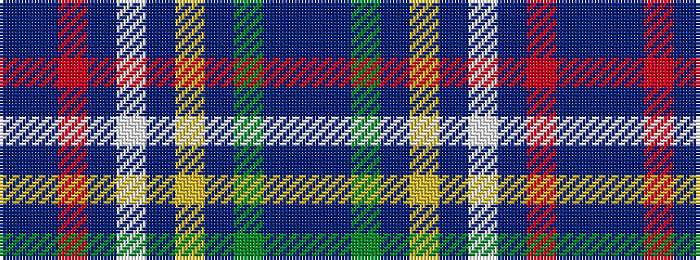

BBGBYBWBRBB

It is a 11 stripe tartan.

<figure class="pat-woven">

<figcaption>idealised sample</figcaption>
</figure>

## Colour Sequence



## Tartans with this colour sequence

| Tartans |
|---------------|
| [Manx Hunting](/variants/s11/db38n1o11n1w4n1ly4n1y20n1t6~x2/)|
||
