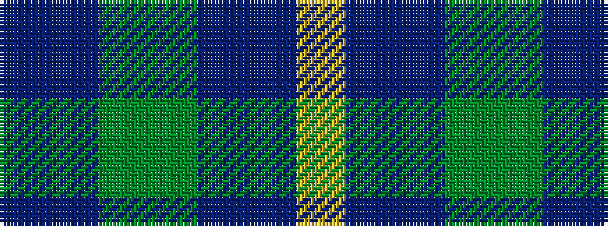

BBGGBBY

It is a 7 stripe tartan.

<figure class="pat-woven">

<figcaption>idealised sample</figcaption>
</figure>

## Colour Sequence



## Tartans with this colour sequence

| Tartans |
|---------------|
| [Unidentified Waistcoat](/setts/s7/db4db4dg16dg16db4db4ly1~x4/)|
||
| [Unidentified, Waistcoat](/setts/s7/db4db4dg16g16db4db4ly1~x4/)|
||
