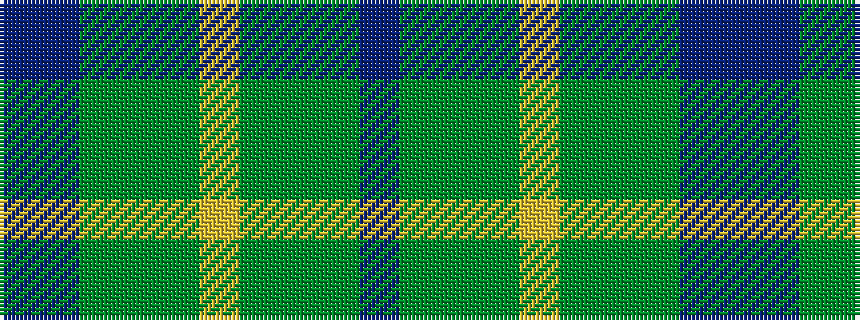

BBGGGYGGGB

It is a 10 stripe tartan.

<figure class="pat-woven">

<figcaption>idealised sample</figcaption>
</figure>

## Colour Sequence



## Tartans with this colour sequence

| Tartans |
|---------------|
| [United Distillers Corporate Tartan](/variants/s10/dr12dy1dg12dy12ly2dy12dg12dy1dr12t2~x2/)|
||
