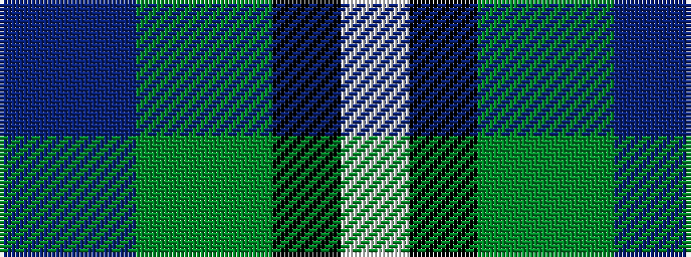

BBGGKW

It is a 6 stripe tartan.

<figure class="pat-woven">

<figcaption>idealised sample</figcaption>
</figure>

## Colour Sequence



## Tartans with this colour sequence

| Tartans |
|---------------|
| [Williams, Edmund (Personal)](/setts/s6/db15dp15g15dg15k8w5~x2/)|
||
| [Williams, Edmund (Personal)](/setts/s6/dp15dp15g15dg15k8w5~x2/)|
||
