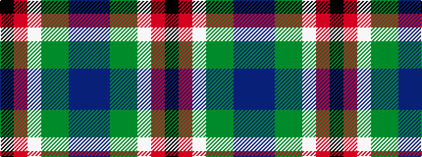

BBGGWRK

It is a 7 stripe tartan.

<figure class="pat-woven">

<figcaption>idealised sample</figcaption>
</figure>

## Colour Sequence



## Tartans with this colour sequence

| Tartans |
|---------------|
| [Wilson's, No 121](/variants/s7/t4p3gi1g9w1r8k1~x4/)|
||
