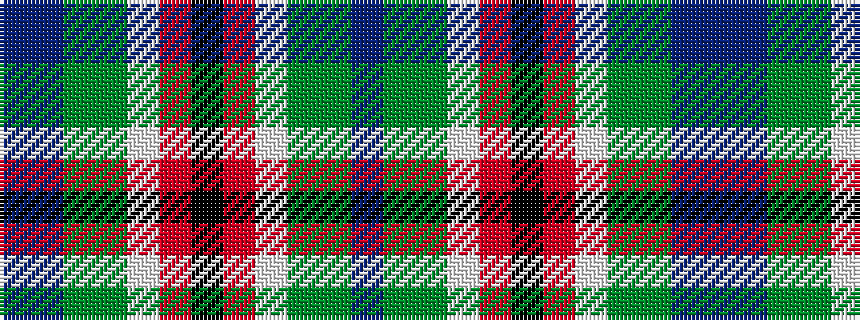

BBGGWRKRWGGB

It is a 12 stripe tartan.

<figure class="pat-woven">

<figcaption>idealised sample</figcaption>
</figure>

## Colour Sequence



## Tartans with this colour sequence

| Tartans |
|---------------|
| [Wilson's No.121](/setts/s12/t4dp3y1g9lb1r8k1~x4/)|
||
