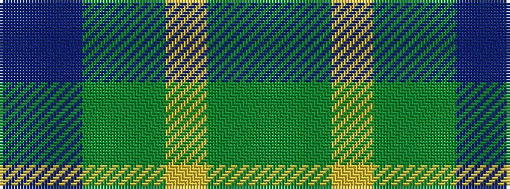

BBGGYGG

It is a 7 stripe tartan.

<figure class="pat-woven">

<figcaption>idealised sample</figcaption>
</figure>

## Colour Sequence



## Tartans with this colour sequence

| Tartans |
|---------------|
| [Reidy Wedding](/variants/s7/g31dg7lo3dg14g8db18dp5~x2/)|
||
