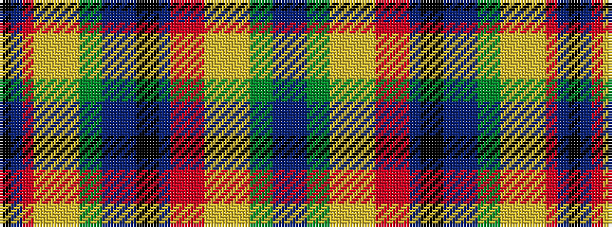

BBGGYYYYRRRBKKBBBGGYYYYRBK

It is a 26 stripe tartan.

<figure class="pat-woven">

<figcaption>idealised sample</figcaption>
</figure>

## Colour Sequence



## Tartans with this colour sequence

| Tartans |
|---------------|
| [(1) Trithart](/setts/s26/k79dt1o1lo1ly1lyi1lg1gi1g1b1bi1dp1k10ki7dp4m4r4o4lo4ly4lyi4lg4gi4g4b4bi4/)|
||
