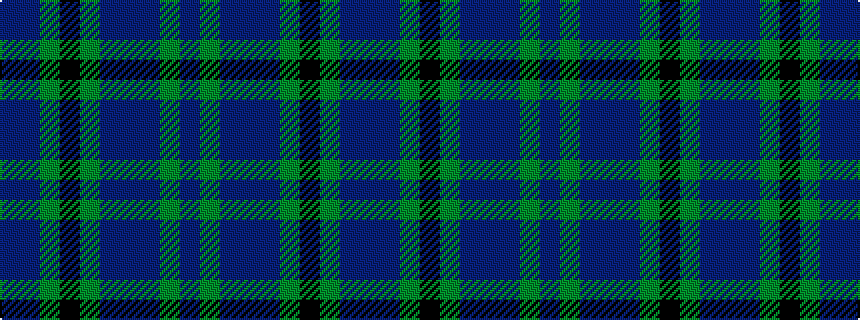

BBGKGBBBGB

It is a 10 stripe tartan.

<figure class="pat-woven">

<figcaption>idealised sample</figcaption>
</figure>

## Colour Sequence



## Tartans with this colour sequence

| Tartans |
|---------------|
| [Berkshire #1 (District)](/variants/s10/n5g3n1db8n10g5k1g5n1b2~x4/)|
||
