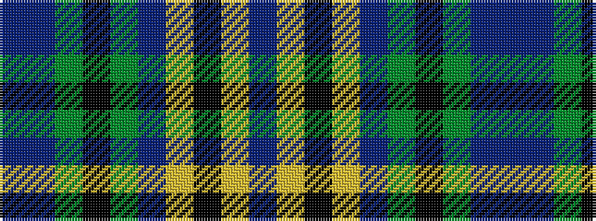

BBGKGBYKYB

It is a 10 stripe tartan.

<figure class="pat-woven">

<figcaption>idealised sample</figcaption>
</figure>

## Colour Sequence



## Tartans with this colour sequence

| Tartans |
|---------------|
| [St. Andrews University (Corporate)](/setts/s10/db6ly3k2ly5db30g2k4g2db6db4~x2/)|
||
