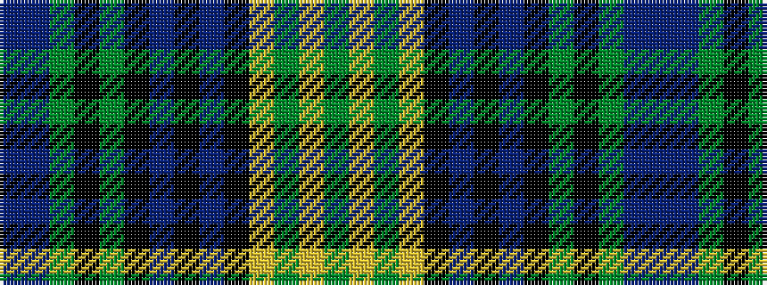

BBGKGKBKBKYGYG

It is a 14 stripe tartan.

<figure class="pat-woven">

<figcaption>idealised sample</figcaption>
</figure>

## Colour Sequence



## Tartans with this colour sequence

| Tartans |
|---------------|
| [Balmaha](/setts/s14/dy3ly3dy12ly1k1db12k1db12k1dg12k1dy12t3db2~x2/)|
||
