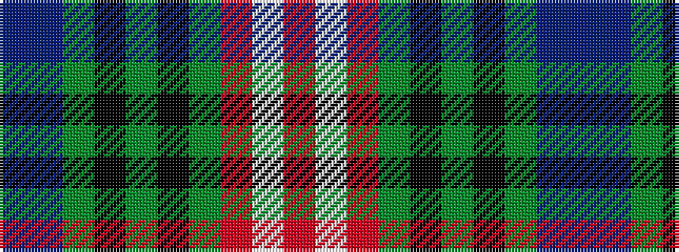

BBGKGKGRWR

It is a 10 stripe tartan.

<figure class="pat-woven">

<figcaption>idealised sample</figcaption>
</figure>

## Colour Sequence



## Tartans with this colour sequence

| Tartans |
|---------------|
| [Lyons](/setts/s10/t9db3g11k7g3k3g32r3w3r7~x2/)|
||
