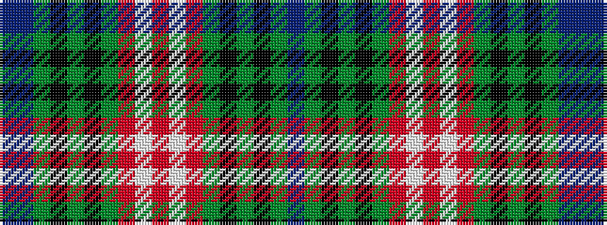

BBGKGKGRWRWRGKGKGB

It is a 18 stripe tartan.

<figure class="pat-woven">

<figcaption>idealised sample</figcaption>
</figure>

## Colour Sequence



## Tartans with this colour sequence

| Tartans |
|---------------|
| [Lyons Tartan](/variants/s18/t9db3g11k7gi3k3gi32r3w3r7~x2/)|
||
