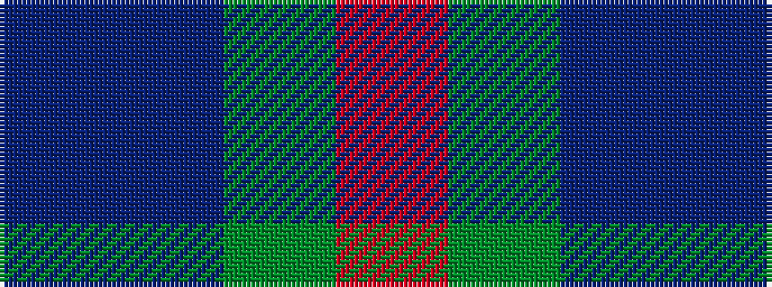

BBGR

It is a 4 stripe tartan.

<figure class="pat-woven">

<figcaption>idealised sample</figcaption>
</figure>

## Colour Sequence



## Tartans with this colour sequence

| Tartans |
|---------------|
| [Norwich No.040](/setts/s4/t6db6g6r1~x2/)|
||
| [Unidentified No 40](/setts/s4/b6db6dg6r1~x2/)|
||
| [Unnamed No 40](/setts/s4/b6db6g6r1~x2/)|
||
