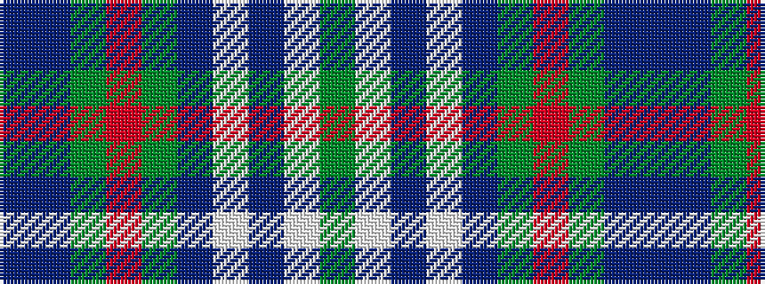

BBGRGBWBWG

It is a 10 stripe tartan.

<figure class="pat-woven">

<figcaption>idealised sample</figcaption>
</figure>

## Colour Sequence



## Tartans with this colour sequence

| Tartans |
|---------------|
| [Morneau (Quebec), Richard (Personal)](/variants/s10/t29do8g21r3g8t16w3do3w3g8~x2/)|
||
| [Morneau, Richard (Personal)](/variants/s10/b29db8g21r3g8b11w3db3w3g8~x2/)|
||
