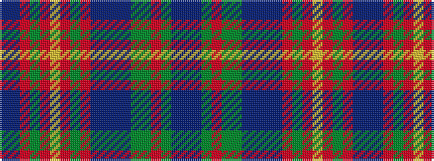

BBGRGGBBBBRGRYRGRBB

It is a 19 stripe tartan.

<figure class="pat-woven">

<figcaption>idealised sample</figcaption>
</figure>

## Colour Sequence



## Tartans with this colour sequence

| Tartans |
|---------------|
| [United Distillers, (Warp)](/setts/s19/db12b1g12r2g12dg12b1db12b2dr12o1dg12o12ly2o12dg12o1dr12b2~x2/)|
||
