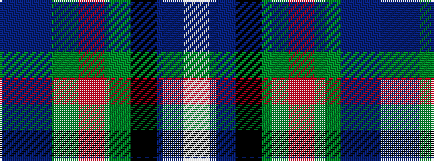

BBGRGKBW

It is a 8 stripe tartan.

<figure class="pat-woven">

<figcaption>idealised sample</figcaption>
</figure>

## Colour Sequence



## Tartans with this colour sequence

| Tartans |
|---------------|
| [Alba](/variants/s8/dp24dt2g3m2g3k11dt29w2~x2/)|
||
