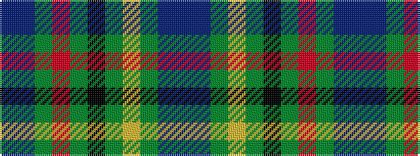

BBGRGKGYGBB

It is a 11 stripe tartan.

<figure class="pat-woven">

<figcaption>idealised sample</figcaption>
</figure>

## Colour Sequence



## Tartans with this colour sequence

| Tartans |
|---------------|
| [Pendleton Dress](/setts/s11/dbi6db40dg34r5dg34k6dg34ly5dg34db40dbi6/)|
||
| [Pendleton Hunting](/setts/s11/dbi2db16dg14r3dg14k3dg14lo3dg14db16dbi2~x2/)|
||
