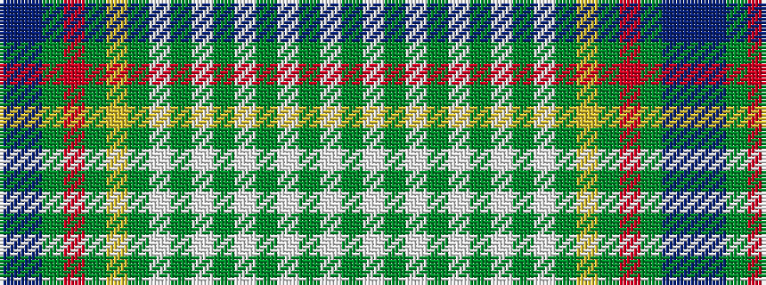

BBGRGYGWGWGWGWGWG

It is a 17 stripe tartan.

<figure class="pat-woven">

<figcaption>idealised sample</figcaption>
</figure>

## Colour Sequence



## Tartans with this colour sequence

| Tartans |
|---------------|
| [Bryant](/setts/s17/g20lb2g2lb2g2lb8g2lb2g2lb2g20ly4g8r2g4do1dp2~x2/)|
||
| [Bryant (Name)](/setts/s17/g20w2g2w2g2w8g2w2g2w2g20ly4g8r2g4do1dp2~x2/)|
||
