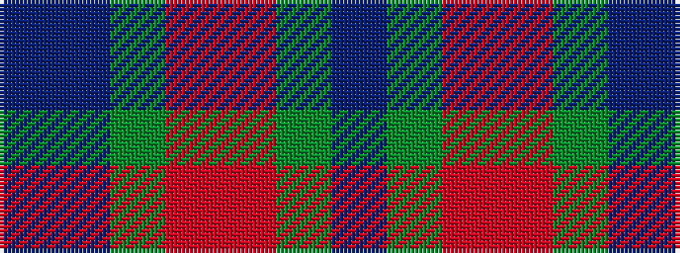

BBGRRGB

It is a 7 stripe tartan.

<figure class="pat-woven">

<figcaption>idealised sample</figcaption>
</figure>

## Colour Sequence



## Tartans with this colour sequence

| Tartans |
|---------------|
| [Dempster, Ross (Personal)](/variants/s7/db4dg2r17ri9dg10db30n2~x2/)|
||
| [Ross Dempster (Personal)](/variants/s7/db4dg2r18ri10dg10db29b4~x2/)|
||
