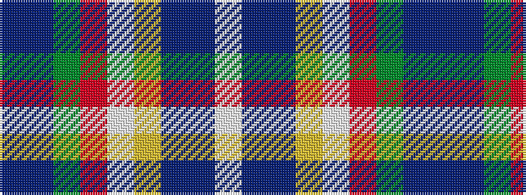

BBGRWYBBW

It is a 9 stripe tartan.

<figure class="pat-woven">

<figcaption>idealised sample</figcaption>
</figure>

## Colour Sequence



## Tartans with this colour sequence

| Tartans |
|---------------|
| [Army Ranger](/setts/s9/dt11dti6dg25r1w2lo1dt25dti5w7~x2/)|
||
