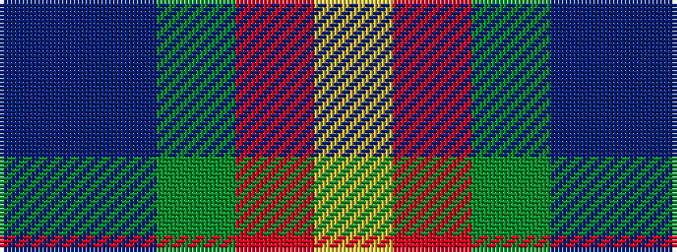

BBGRY

It is a 5 stripe tartan.

<figure class="pat-woven">

<figcaption>idealised sample</figcaption>
</figure>

## Colour Sequence



## Tartans with this colour sequence

| Tartans |
|---------------|
| [Buncle (Duns)](/variants/s5/n9do2dg12o31lo9~x2/)|
||
