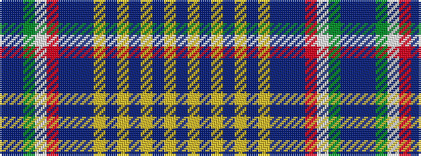

BBGWRBBBYBYBYBYB

It is a 16 stripe tartan.

<figure class="pat-woven">

<figcaption>idealised sample</figcaption>
</figure>

## Colour Sequence



## Tartans with this colour sequence

| Tartans |
|---------------|
| [De Baseggio (Personal)](/setts/s16/b4dt6g1w1r1dt6b4dt2lo1dt1lo1dt1lo1dt2lo3dt3~x4/)|
||
| [de Baseggio (Golden Bones)](/setts/s16/t4db6g1w1r1db6t4db2lo1db1lo1db1lo1db2lo3db3~x4/)|
||
