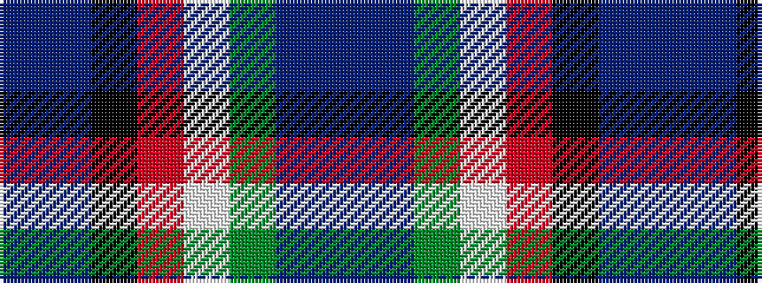

BBGWRKBB

It is a 8 stripe tartan.

<figure class="pat-woven">

<figcaption>idealised sample</figcaption>
</figure>

## Colour Sequence



## Tartans with this colour sequence

| Tartans |
|---------------|
| [Scottish Italian](/setts/s8/b11db5g4w3r3k16db28b2~x2/)|
||
