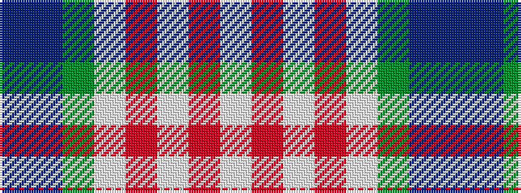

BBGWRWRW

It is a 8 stripe tartan.

<figure class="pat-woven">

<figcaption>idealised sample</figcaption>
</figure>

## Colour Sequence



## Tartans with this colour sequence

| Tartans |
|---------------|
| [Jubilee, South Canterbury Centre Piping & Dancing Association](/setts/s8/b36db5g5w2r4w2m9w22~x2/)|
||
| [South Canterbury Jubillee (Corporate](/setts/s8/t36db5g5w2r4w2r9w22~x2/)|
||
