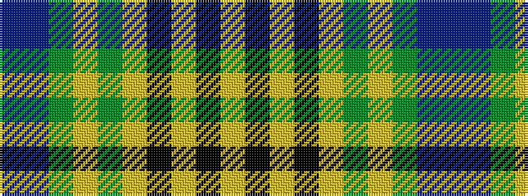

BBGYGYKYKY

It is a 10 stripe tartan.

<figure class="pat-woven">

<figcaption>idealised sample</figcaption>
</figure>

## Colour Sequence



## Tartans with this colour sequence

| Tartans |
|---------------|
| [McClurg, William Thomas (Personal)](/variants/s10/ly4k1ly2k1ly32g1ly3g32t1t2~x2/)|
||
