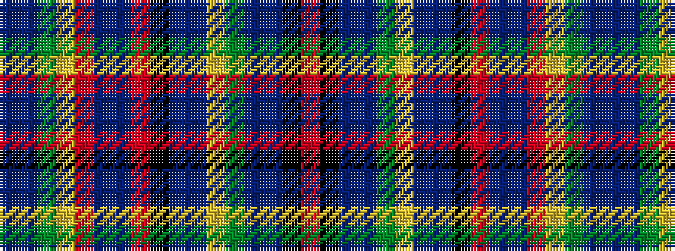

BBGYRBBRKBBYGBBKR

It is a 17 stripe tartan.

<figure class="pat-woven">

<figcaption>idealised sample</figcaption>
</figure>

## Colour Sequence



## Tartans with this colour sequence

| Tartans |
|---------------|
| [Kennewell (Personal)](/variants/s17/db25t15g6lo3r2db10t5o5k2t15db25lo5g2t25db15k6o3/)|
||
