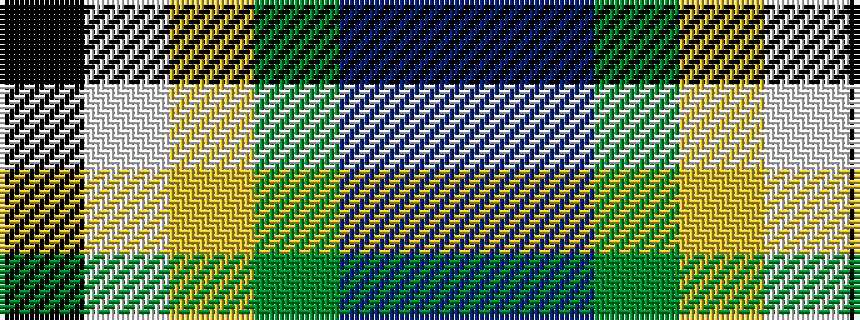

BBGYWK

It is a 6 stripe tartan.

<figure class="pat-woven">

<figcaption>idealised sample</figcaption>
</figure>

## Colour Sequence



## Tartans with this colour sequence

| Tartans |
|---------------|
| [Lethcoe (Thousand Oaks) (Personal)](/setts/s6/k16w4ly2g31t4dp4~x4/)|
||
