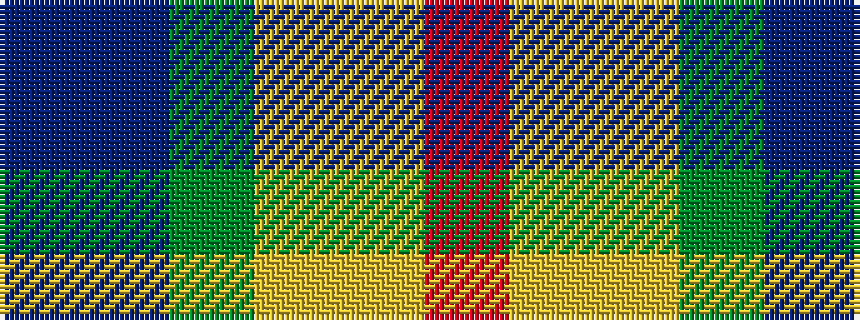

BBGYYR

It is a 6 stripe tartan.

<figure class="pat-woven">

<figcaption>idealised sample</figcaption>
</figure>

## Colour Sequence



## Tartans with this colour sequence

| Tartans |
|---------------|
| [Pride, The Tartan of](/setts/s6/r8lo4ly3g6t6dp1~x5/)|
||
