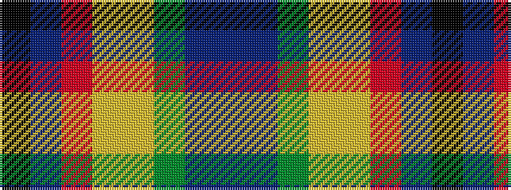

BBGYYRBK

It is a 8 stripe tartan.

<figure class="pat-woven">

<figcaption>idealised sample</figcaption>
</figure>

## Colour Sequence



## Tartans with this colour sequence

| Tartans |
|---------------|
| [Way of the Rainbow](/setts/s8/k1dbi24r1lo1ly1g1db1dp1~x7/)|
||
