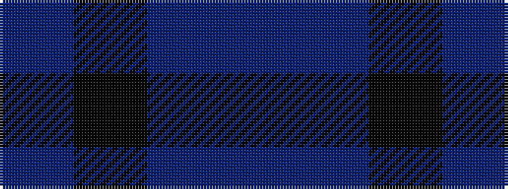

BBKB

It is a 4 stripe tartan.

<figure class="pat-woven">

<figcaption>idealised sample</figcaption>
</figure>

## Colour Sequence



## Tartans with this colour sequence

| Tartans |
|---------------|
| [Lord Willy's (Corporate)](/setts/s4/n10k2db2dp1~x5/)|
||
| [Lord Willy's (New York)](/setts/s4/n25k5b5p3~x2/)|
||
