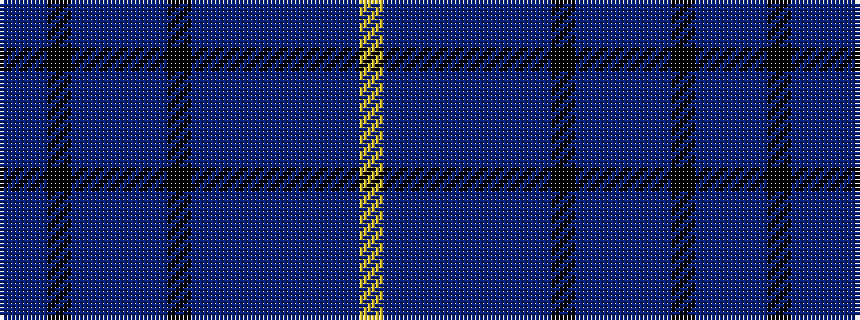

BBKBBBBKBBBBBBBY

It is a 16 stripe tartan.

<figure class="pat-woven">

<figcaption>idealised sample</figcaption>
</figure>

## Colour Sequence



## Tartans with this colour sequence

| Tartans |
|---------------|
| [Midnight Sunrise](/variants/s16/lo3db1dp1b8dp1db6b3db4k8b1db4dp1db2k4db16dp2~x2/)|
||
