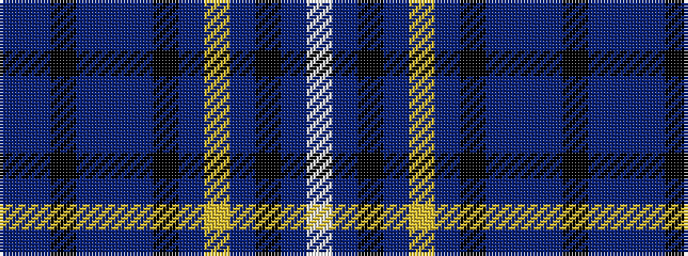

BBKBBBKBYBKBW

It is a 13 stripe tartan.

<figure class="pat-woven">

<figcaption>idealised sample</figcaption>
</figure>

## Colour Sequence



## Tartans with this colour sequence

| Tartans |
|---------------|
| [Heddle](/setts/s13/n8db24k2db2n8db2k2db4ly2db4k2n12w3~x2/)|
||
