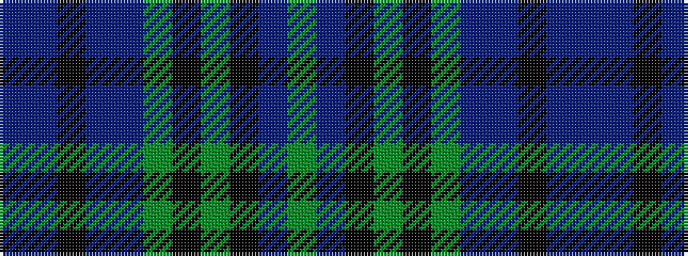

BBKBBGKGKBG

It is a 11 stripe tartan.

<figure class="pat-woven">

<figcaption>idealised sample</figcaption>
</figure>

## Colour Sequence



## Tartans with this colour sequence

| Tartans |
|---------------|
| [Hudson Hunting (Personal)](/variants/s11/db4t2k2db12t4g6k6g28k2t2g3~x2/)|
||
