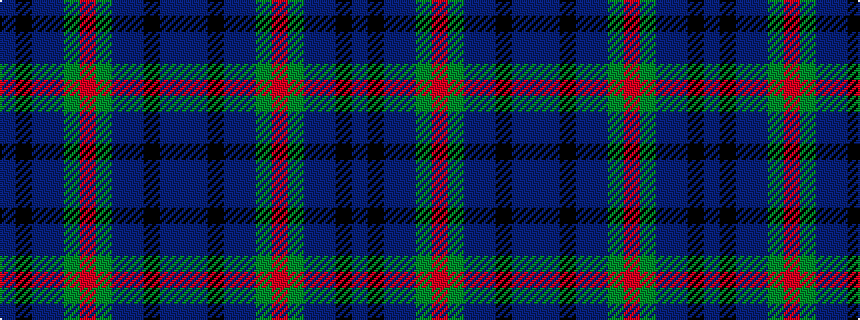

BBKBBGRGBBKB

It is a 12 stripe tartan.

<figure class="pat-woven">

<figcaption>idealised sample</figcaption>
</figure>

## Colour Sequence



## Tartans with this colour sequence

| Tartans |
|---------------|
| [New York City American District Tartan Tartan Number: 3812. Earliest known date: 2002 Created to celebrate Tartan Day 6th April 2002 in New York City on the occasion of the greatest parade of Pipes and Drums ever seen. Colourings are for the streets and buildings of New York: green is Central Park; blue the rivers (Hudson, Harlem & East) that surround Manhattan; the two black stripes are to honour the memory of the twin towers of the World Trade centre destroyed in "911" (The American way of signifying September 11th). See products available Copyright © Blair Urquhart, Comrie, 2015](/setts/s12/db3k1db3n3g4r1g4n3db3k1db3dbi2~x8/)|
|![New York City American District Tartan Tartan Number: 3812. Earliest known date: 2002 Created to celebrate Tartan Day 6th April 2002 in New York City on the occasion of the greatest parade of Pipes and Drums ever seen. Colourings are for the streets and buildings of New York: green is Central Park; blue the rivers (Hudson, Harlem & East) that surround Manhattan; the two black stripes are to honour the memory of the twin towers of the World Trade centre destroyed in "911" (The American way of signifying September 11th). See products available Copyright © Blair Urquhart, Comrie, 2015 example sett](/setts/s12/db3k1db3n3g4r1g4n3db3k1db3dbi2~x8/sett.png)|
