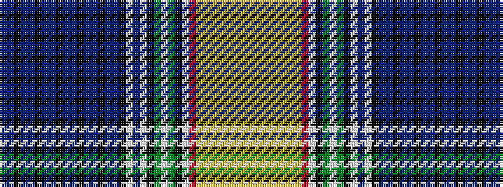

BBKBBKBBKBBKBBKBBKWBWKGWGKWRYYYYYYYY

It is a 36 stripe tartan.

<figure class="pat-woven">

<figcaption>idealised sample</figcaption>
</figure>

## Colour Sequence



## Tartans with this colour sequence

| Tartans |
|---------------|
| [Am Yisrael Chai](/variants/s36/p1b2k1p1b2k1p1b2k1p1b2k1p1b2k1p1b2k1w27b27w6k3y2w1y2k3w2r9lo2ly1lo2ly1lo2ly1lo2ly1~x2/)|
||
