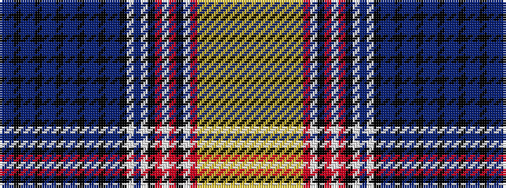

BBKBBKBBKBBKBBKBBKWBWKRWRKWRYYYYYYYY

It is a 36 stripe tartan.

<figure class="pat-woven">

<figcaption>idealised sample</figcaption>
</figure>

## Colour Sequence



## Tartans with this colour sequence

| Tartans |
|---------------|
| [Am Yisrael Chair (Corporate)](/variants/s36/dp1db2k1dp1db2k1dp1db2k1dp1db2k1dp1db2k1dp1db2k1w27db27w6k3o2w1o2k3w2r9lo2ly1lo2ly1lo2ly1lo2ly1~x2/)|
||
