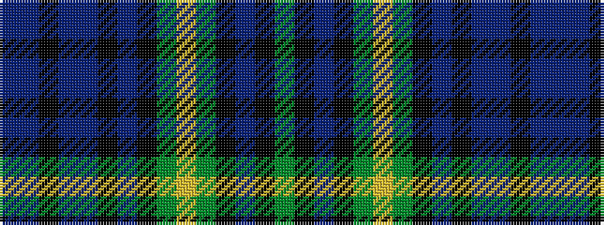

BBKBBKBKGYGKBKG

It is a 15 stripe tartan.

<figure class="pat-woven">

<figcaption>idealised sample</figcaption>
</figure>

## Colour Sequence



## Tartans with this colour sequence

| Tartans |
|---------------|
| [Angove, the Black Swan](/setts/s15/db18dp2k2db2dp2k1db2k8g1ly1g6k8db14k2g2~x2/)|
||
