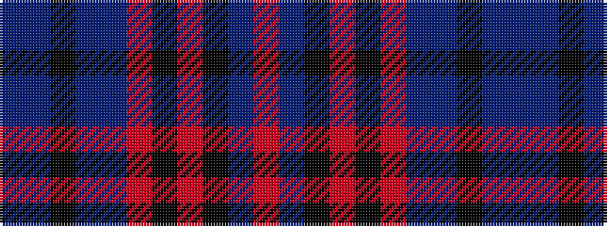

BBKBBRKRKBR

It is a 11 stripe tartan.

<figure class="pat-woven">

<figcaption>idealised sample</figcaption>
</figure>

## Colour Sequence



## Tartans with this colour sequence

| Tartans |
|---------------|
| [Hudson (Personal)](/variants/s11/db4t2k2db12t4r6k6r28k2t2r3~x2/)|
||
