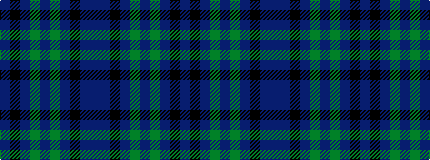

BBKBGBGBKB

It is a 10 stripe tartan.

<figure class="pat-woven">

<figcaption>idealised sample</figcaption>
</figure>

## Colour Sequence



## Tartans with this colour sequence

| Tartans |
|---------------|
| [Scottish Airports Corporate Tartan](/variants/s10/db18k17db3g18db4g18db3k17db18p4~x2/)|
||
