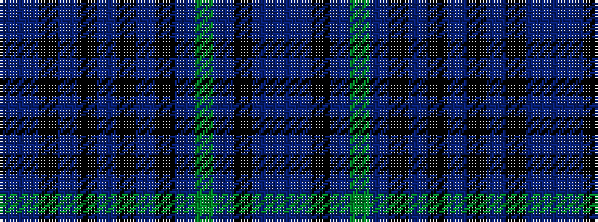

BBKBGBKBKBKBKBB

It is a 15 stripe tartan.

<figure class="pat-woven">

<figcaption>idealised sample</figcaption>
</figure>

## Colour Sequence



## Tartans with this colour sequence

| Tartans |
|---------------|
| [ShadowHalls](/setts/s15/dt1dt8k8dt8dg1dt4k11dt1k1dt1k1dt1k11dt4dt1~x4/)|
||
