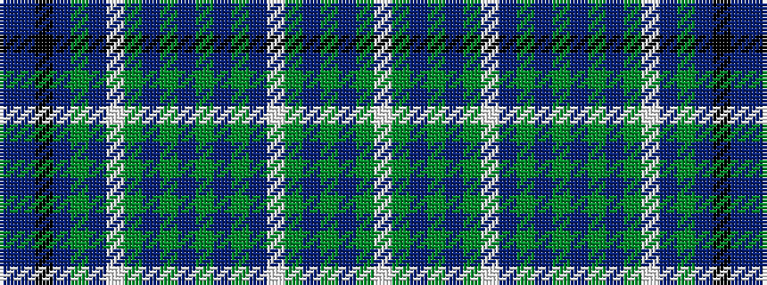

BBKBGBWGBGBGBGBWGBGBGW

It is a 22 stripe tartan.

<figure class="pat-woven">

<figcaption>idealised sample</figcaption>
</figure>

## Colour Sequence



## Tartans with this colour sequence

| Tartans |
|---------------|
| [Tiree, Turquoise (Dance)](/setts/s22/w42g3b1g2dp1g2w2t20g1dp2g3b1g2dp1g2w2b3g1b2k1b2t2~x2/)|
||
