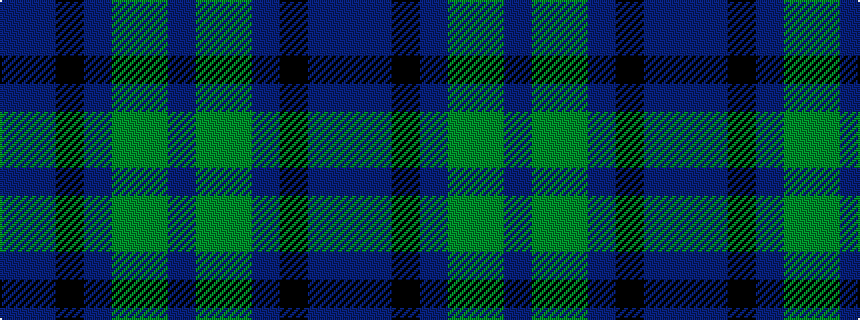

BBKBGGB

It is a 7 stripe tartan.

<figure class="pat-woven">

<figcaption>idealised sample</figcaption>
</figure>

## Colour Sequence



## Tartans with this colour sequence

| Tartans |
|---------------|
| [Scottish Odyssey](/setts/s7/b7dbi11k3dbi11dy11g22db3~x2/)|
||
| [Scottish Odyssey (Fashion)](/setts/s7/db7b12k3b12dy12g25dt3~x2/)|
||
