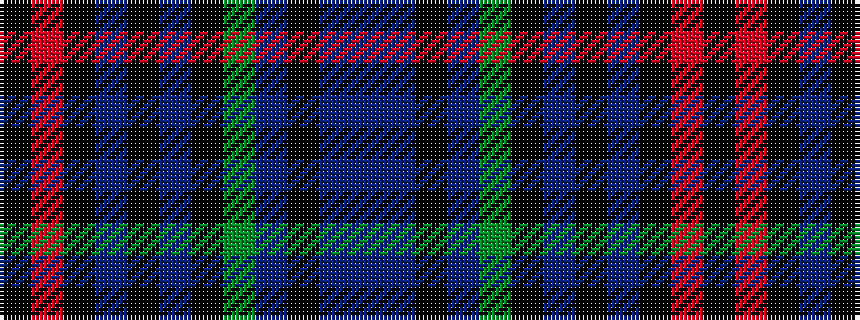

BBKBGKBKBKRK

It is a 12 stripe tartan.

<figure class="pat-woven">

<figcaption>idealised sample</figcaption>
</figure>

## Colour Sequence



## Tartans with this colour sequence

| Tartans |
|---------------|
| [Braveheart -Warrior (hunting)](/setts/s12/k43o7k9dp3k3dp3k3g18dr9k3dr4dr4~x2/)|
||
