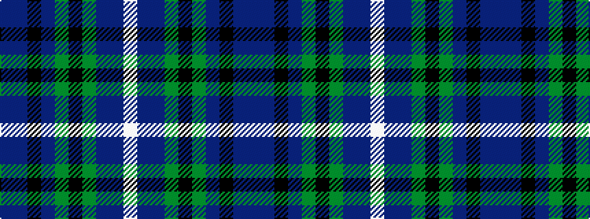

BBKBGKGBBW

It is a 10 stripe tartan.

<figure class="pat-woven">

<figcaption>idealised sample</figcaption>
</figure>

## Colour Sequence



## Tartans with this colour sequence

| Tartans |
|---------------|
| [Cowal](/variants/s10/dbi6db22k12dp10g3k1g3dp10dbi2w2~x2/)|
||
| [Cowal (Corporate)](/variants/s10/db6dt22k12dp10g3k1g3dp10db2w2~x2/)|
||
