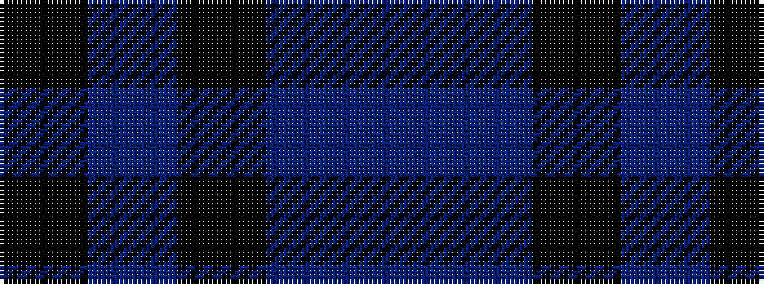

BBKBK

It is a 5 stripe tartan.

<figure class="pat-woven">

<figcaption>idealised sample</figcaption>
</figure>

## Colour Sequence



## Tartans with this colour sequence

| Tartans |
|---------------|
| [Fenston/Morris (Personal)](/setts/s5/k33db8k4db35p3~x2/)|
||
| [Williams (New York) (Personal)](/setts/s5/k30dt6k6dt41t2~x2/)|
||
