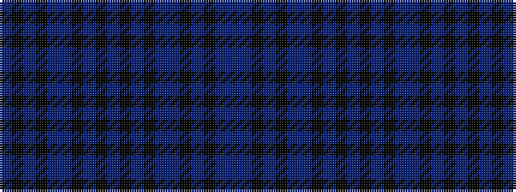

BBKBKBBKBKBKBKBBKBKB

It is a 20 stripe tartan.

<figure class="pat-woven">

<figcaption>idealised sample</figcaption>
</figure>

## Colour Sequence



## Tartans with this colour sequence

| Tartans |
|---------------|
| [Indigo Blue](/setts/s20/t5k1t1k1t5db18k1db4k1db9k1db4k1db18t5k1t1k1t5db4~x2/)|
||
