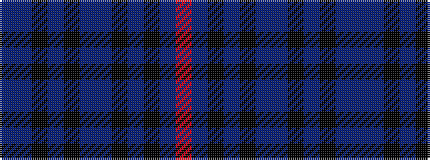

BBKBKBBKBKBR

It is a 12 stripe tartan.

<figure class="pat-woven">

<figcaption>idealised sample</figcaption>
</figure>

## Colour Sequence



## Tartans with this colour sequence

| Tartans |
|---------------|
| [Roberts (Welsh Name)](/setts/s12/db4t20k3t2k3t20db24k3db2k3db24r4/)|
||
