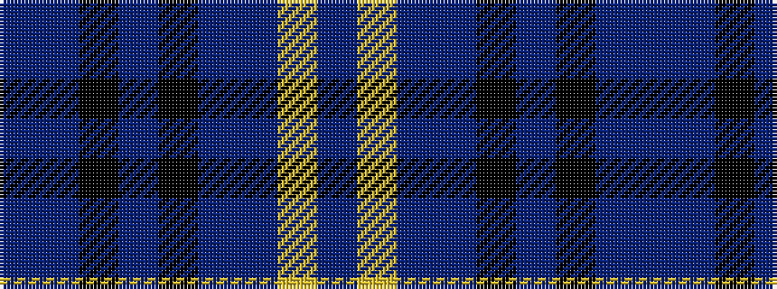

BBKBKBBYB

It is a 9 stripe tartan.

<figure class="pat-woven">

<figcaption>idealised sample</figcaption>
</figure>

## Colour Sequence



## Tartans with this colour sequence

| Tartans |
|---------------|
| [Goldblatt, Joe, Jeff (Personal)](/setts/s9/dp6dt4k4dt26k12dp3db42ly4db4/)|
||
