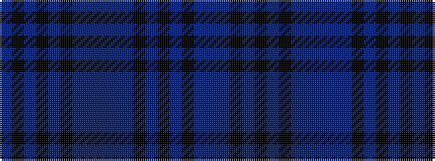

BBKBKBKBBBBBKBKBKB

It is a 18 stripe tartan.

<figure class="pat-woven">

<figcaption>idealised sample</figcaption>
</figure>

## Colour Sequence



## Tartans with this colour sequence

| Tartans |
|---------------|
| [LS Curling (Corporate)](/setts/s18/db2db4k2db25k4db2k4db10db4db2db4db11k2db2k24db4k2db2~x2/)|
||
